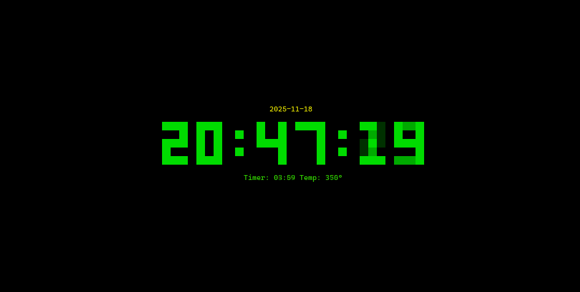
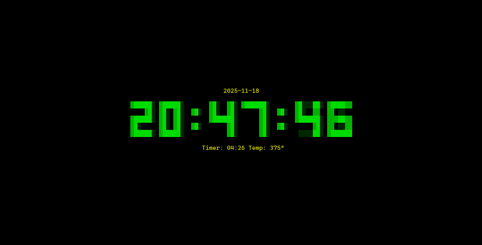
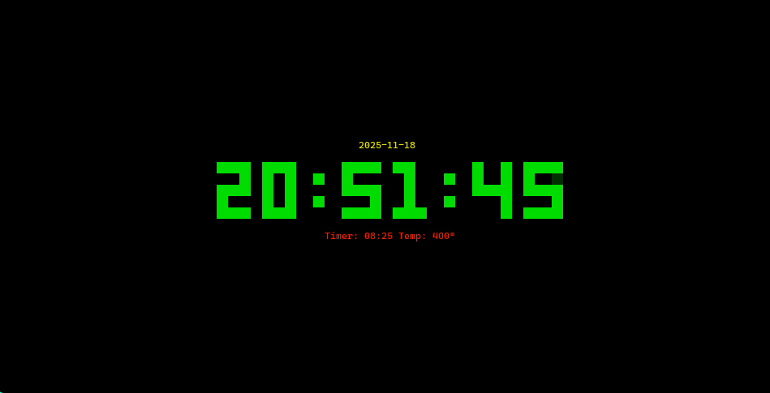
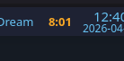
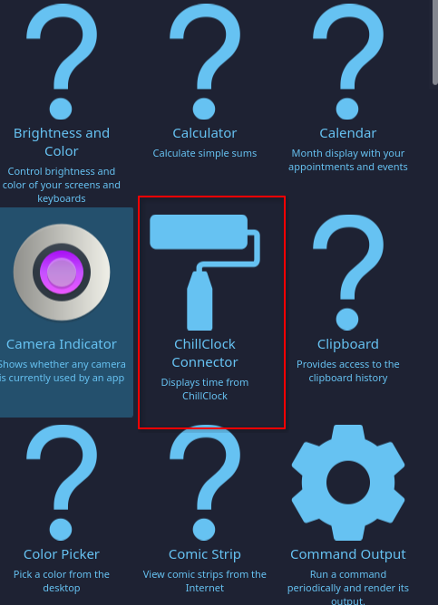

# ChillClock
A Terminal clock that also incorporates [the DHV Session Timer](https://github.com/unquenchedservant/DHV-Session-Timer)

Written in Go

- [Install](#install)
- [Screenshots](#screenshots)
- [StreamController (StreamDeck) Plugin](#stream-deck-plugin)
- [Status Bar Integrations](#status-bar-integrations)
  - [Plasma Applet (Linux/KDE)](#plasma-linuxkde)
  - [Waybar (Linux/Hyprland)](#waybar-linuxhyprland)
  - [SwiftBar (MacOS)](#swiftbar-macos)
- [Thanks](#thanks)
- [License](#license)

## Install 
Pre-Requisites: Go ^1.25.4 

```
go install github.com/unquenchedservant/ChillClock/cmd/cclock@latest
```

Make sure to add $HOME/go/bin to your PATH

## Screenshots


![A configuration window is shown. All text is centered. The title is "Configuration" in yellow. The cursor is on "Phase 1 Duration: 4 Minutes" and it is green. The remaining options are white. The remaining options are "Phase 2 Duration: 4 Minutes", "Phase 3 Duration: 2 Minutes", "Phase 1 Temperature: 350°", "Phase 2 Temperature: 375°", "Phase 3 Temperature: 400°". A navigation help bar is below, showing up and down arrows to navigate, "Enter" to "Edit", and "Esc/q/?" to exit the configuration screen ](assets/img/image-5.png)







## Stream Deck Plugin
Instructions for installing and using the StreamDeck Plugin [can be found here](https://github.com/unquenchedservant/ChillClockSDConnector). Requires the StreamController application, [which can be found here](https://github.com/StreamController/StreamController).

## Status Bar Integrations
### Plasma (Linux/KDE)



Copy the cclock_connector folder from `.local/share/plasma/plasmoids/` into `~/.local/share/plasma/plasmoids` then either reboot or run `plasmashell --replace &` in a terminal. `ChillClock Connector` will then show as an applet option when editing a workspace 




Left clicking the timer will start the default timer, right clicking the timer will start the secondary timer


### Waybar (Linux/Hyprland)


To add waybar integration, add the following custom module to your waybar config

```
  "custom/dhv_timer": {
    "exec": "cat ~/.config/ChillClock/current_timer.json",
    "interval": 1,
    "format": "{text}  ",
    "return-type": "json",
    "on-click": "touch ~/.config/ChillClock/.toggle_primary"
  }
```
### SwiftBar (MacOS)
To add the timer in your Mac, you'll need [SwiftBar](https://github.com/swiftbar/SwiftBar) installed 

```
brew install swiftbar
```

Then run SwiftBar once, it will ask you to setup a plugin directory, referred to further as $PLUGINDIR. Set this to your choosing. 

Before creating the SwiftBar plugin, create a script called toggle_file.sh anywhere OUTSIDE of $PLUGINDIR (I recommend ~/.config/ChillClock) with the following: 

```sh
#!/bin/bash
touch ~/.config/ChillClock/.toggle_primary
```

then make that file executable.

Once setup, run `nvim $PLUGINDIR/dhv_timer.1s.sh` (Note: the .1s. is the interval) and enter the following: 

```sh
#!/bin/bash
# <swiftbar.refreshrate>1s</swiftbar.refreshrate>

TIMER_FILE="$HOME/.config/ChillClock/current_timer.json"
TOGGLE_SCRIPT="$HOME/.config/ChillClock/toggle_timer.sh"

if [ -f "$TIMER_FILE" ]; then
  text=$(cat "$TIMER_FILE" | grep -o '"text":"[^"]*"' | cut -d'"' -f4)
  class=$(cat "$TIMER_FILE" | grep -o '"class":"[^"]*"' | cut -d'"' -f4)

  case $class in
  green)
    echo "$TEXT | color=green bash='$TOGGLE_SCRIPT' terminal=false"
    ;;
  yellow)
    echo "$TEXT | color=yellow bash='$TOGGLE_SCRIPT' terminal=false"
    ;;
  red)
    echo "$TEXT | color=red bash='$TOGGLE_SCRIPT' terminal=false"
    ;;
  *)
    echo "$TEXT | color=white bash='$TOGGLE_SCRIPT' terminal=false"
    ;;
  esac
else
  echo "0:00 | color=white bash='$TOGGLE_SCRIPT' terminal=false"
fi
```

The timer should now show and respond to clicks. 
# Thanks
Special thanks to the developers of [clock-tui](https://github.com/race604/clock-tui) as I reverse engineered their implementation to add my weed clock

# License
MIT License, refer to [LICENSE](LICENSE) for detail.

